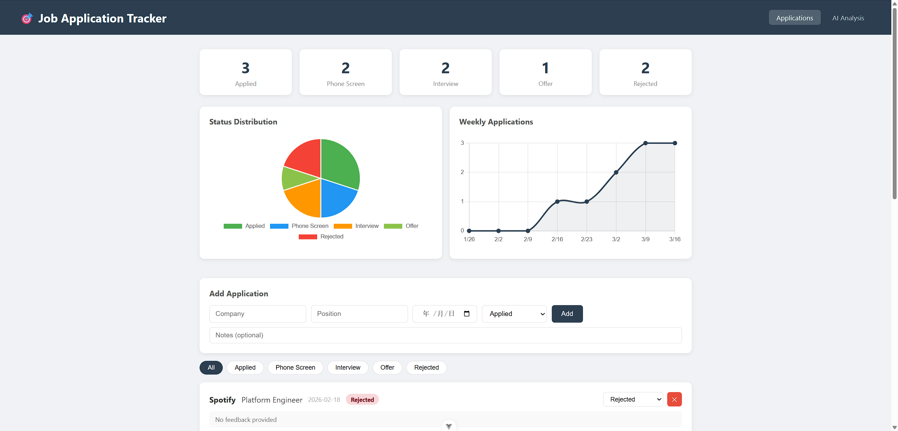
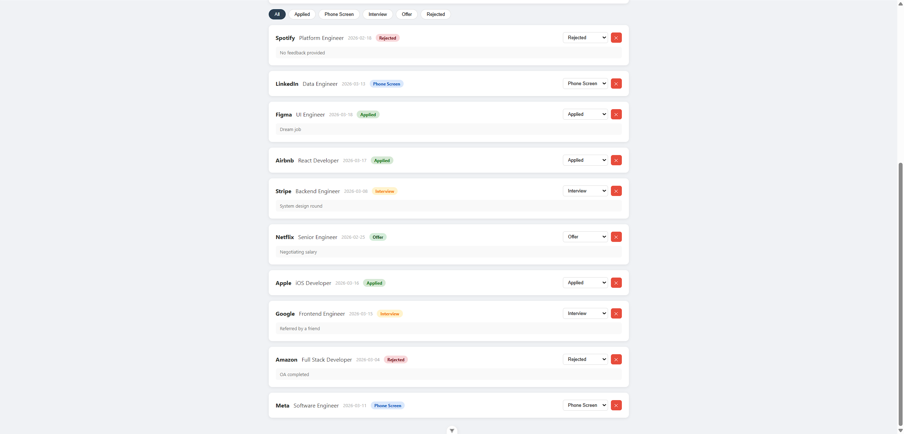
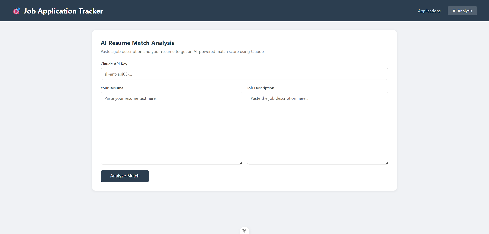

# 🎯 Job Application Tracker

A full-stack web app to track job applications, visualize progress, and analyze resume-JD fit using AI.

Built with **Vue 3** + **Spring Boot** + **MySQL** + **Claude API**.

## Screenshots

### Dashboard


### Application List


### AI Resume Analysis


## Features
- ✅ Add, update, and delete job applications
- 📊 Status distribution pie chart + weekly application trend line chart
- 🤖 AI-powered resume vs JD match analysis (Claude API)
  - Matched skills, missing skills, match score (0–100), summary
- 💾 Persistent storage with MySQL
- 🔍 Filter applications by status

## Tech Stack
- **Frontend**: Vue 3, Vue Router, Chart.js
- **Backend**: Java, Spring Boot, Spring Data JPA, REST API
- **Database**: MySQL 8.0
- **AI**: Anthropic Claude API (claude-sonnet-4-20250514)

## Getting Started

### Prerequisites
- Java 17+
- Node.js 18+
- MySQL 8.0

### Backend
```bash
cd backend
# Update src/main/resources/application.properties with your MySQL credentials
mvn spring-boot:run
```

### Frontend
```bash
cd frontend
npm install
npm run dev
```

Open http://localhost:5173

### AI Analysis
The AI analysis feature requires an Anthropic API key.  
Get one at https://console.anthropic.com — enter it directly in the UI, it is never stored.

## Background
Built to track my own internship search. The AI analysis feature was inspired by my work 
at Google Maps and Shanghai Intelligent Transportation, where I integrated ML and AI APIs 
into production products.